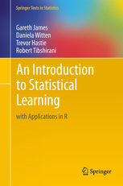
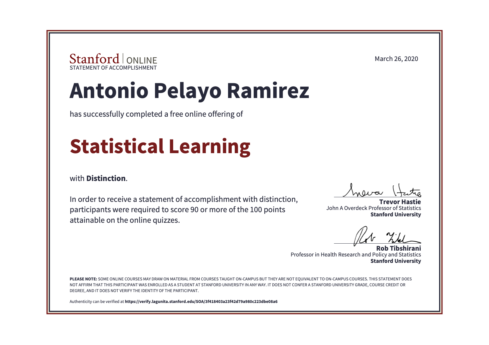

# stanford statistical learning
Projects and notes going through the online Stanford Statistical Learning course,
along with the book An Introduction to Statistical Learning with Applications in R. 

Quizzes and video transcripts are documented once I have finished reading the section
in the book.

### Chapters
Started February 23 
- [x] 1 Introduction - February 24
- [x] 2 Statistical Learning - March 2
- [x] 3 Linear Regression - March 11 
- [x] 4 Classification - March 30
- [x] 5 Resampling Methods - April 3
- [x] 6 Linear Model Selection and Regularization
    - [x] 6.1 Intro and Best Subset Selection - April 3
    - [x] 6.2 Stepwise Selection - April 5
    - [x] 6.3 Backward Stepwise Selection - April 5
    - [x] 6.4 Estimating Test Error - April 7
    - [x] 6.5 Validation and Cross Validation - April 7
    - [x] 6.6 Shrinkage Methods and Ridge Regression - April 8
    - [x] 6.7 The Lasso - April 8
    - [x] 6.8 Tuning Parameter Selection - April 12
    - [x] 6.9 Dimension Reduction Methods - April 13
    - [x] 6.10 Principal Component Regression and Partial Least Squares - April 13
    - [x] 6.R Model Selection in R
        - [x] 6.5.1 Best Subset Selection - April 5
        - [x] 6.5.2 Forward and Backwards Stepwise Selection - April 7
        - [x] 6.5.3 Choosing Models Using Validation Sets and Cross Validation - April 7
        - [x] 6.6.1 Ridge Regression - April 11
        - [x] 6.6.2 The Lasso - April 12
        - [x] 6.7.1 Principal Components Regression - April 14
        - [x] 6.7.2 Partlal Least Squares - April 21
- [ ] 7 Moving Beyond Linearity 
- [ ] 8 Tree-Based Methods
- [ ] 9 Support Vector Machines
- [ ] 10 Unsupervised Learning

