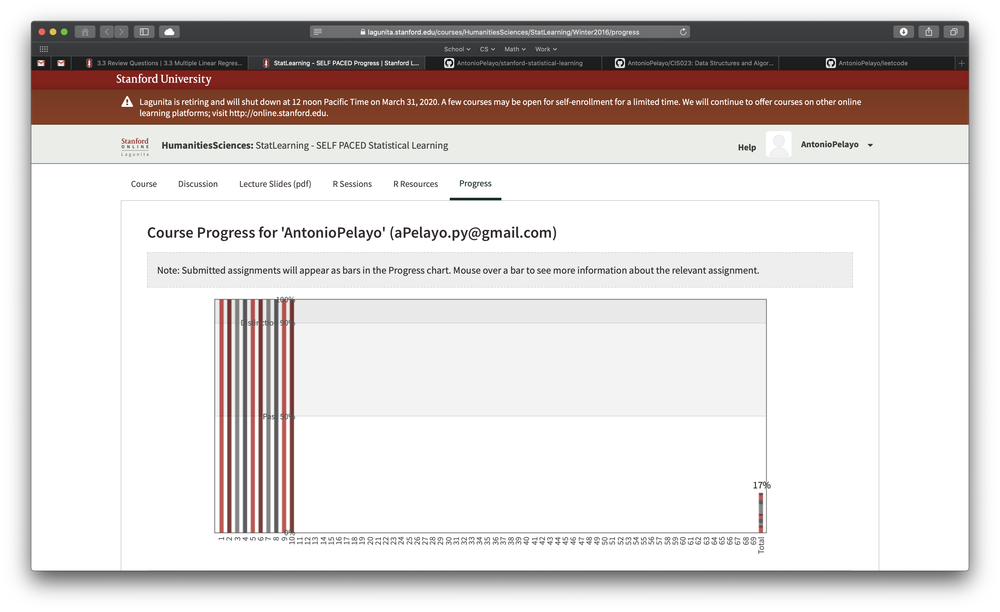

# stanford statistical learning
Projects and notes going through the online Stanford Statistical Learning course,
along with the book An Introduction to Statistical Learning with Applications in R. 

Quizes and video transcripts are documented once I have finished reading the section
in the book.

### Chapters
Started February 23, 2020 
- [x] 1 Introduction - Completed March 1, 2020
- [x] 2 Statistical Learning - Completed March 2, 2020
- [ ] 3 Linear Regression - Projected March 6, 2020 
- [ ] 4 Classification - Projected March 11, 2020
- [ ] 5 Resampling Methods 
- [ ] 6 Linear Model Selection and Regularization
- [ ] Moving Beyond Linearity 
- [ ] 8 Tree-Based Methods
- [ ] 9 Support Vector Machines
- [ ] 10 Unsupervised Learning

### Progress
17% of total
