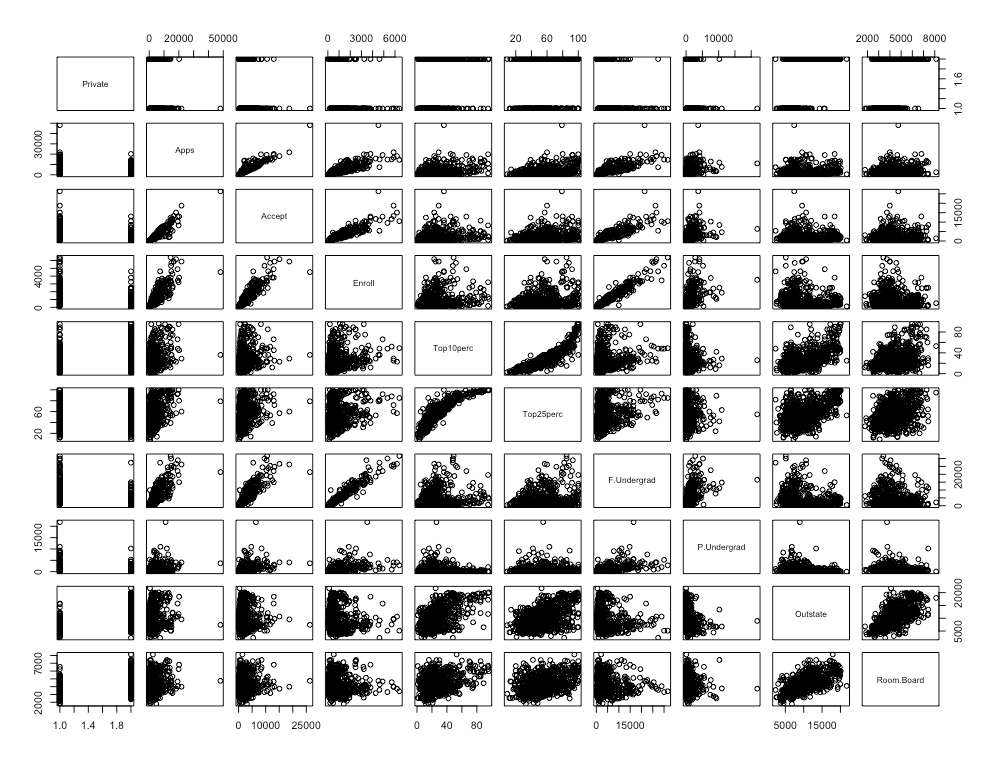
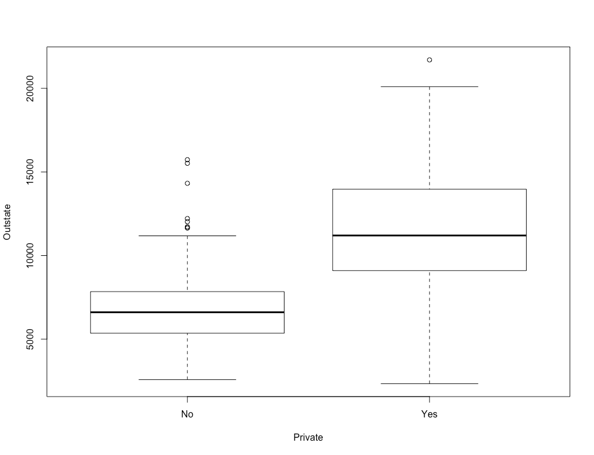
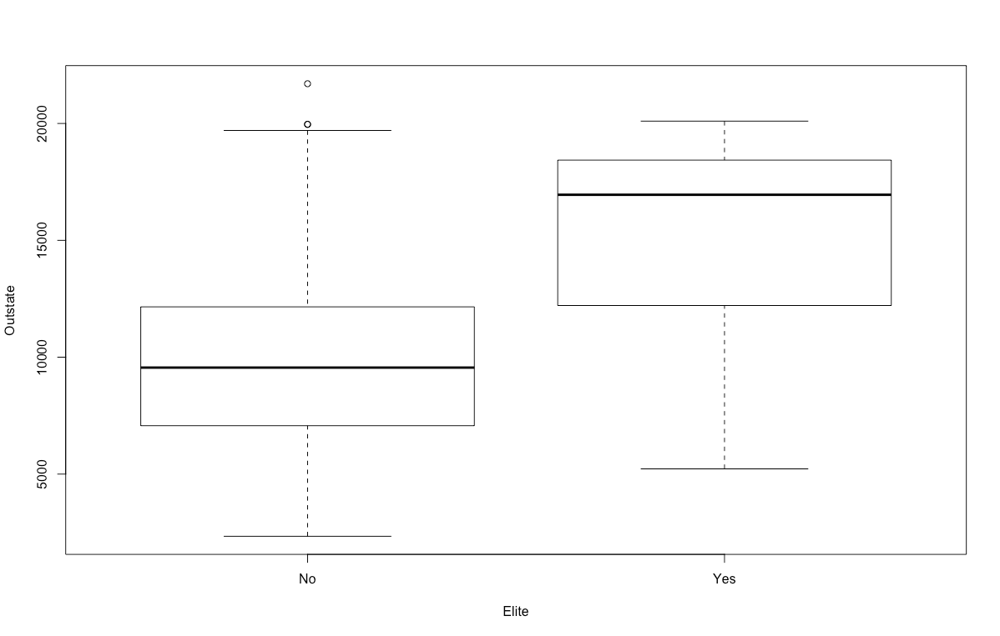
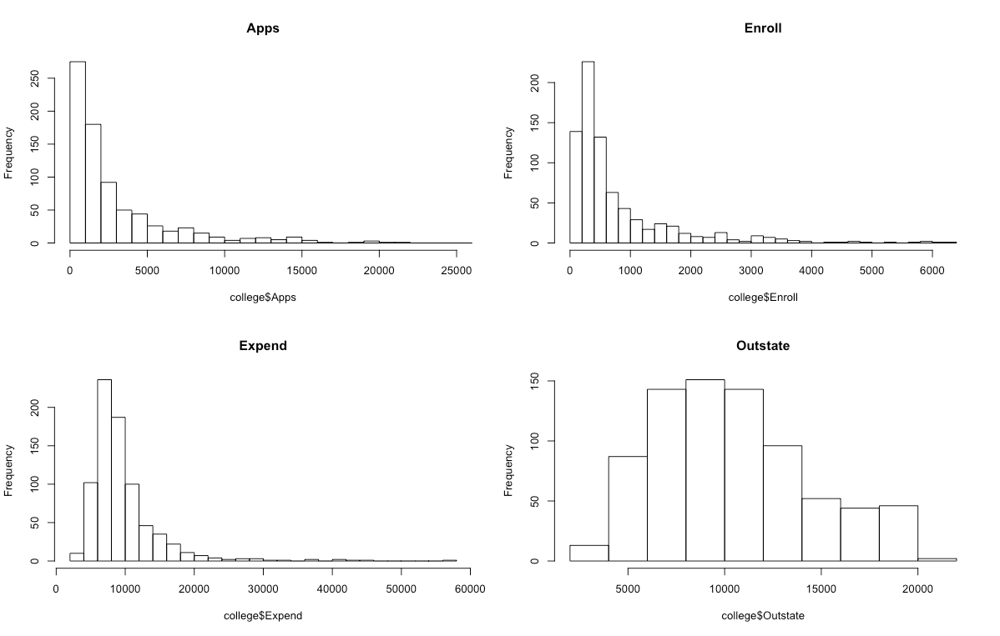

# 2.4 Exercises
## Problem 8
This exercise relates to the College data set, which can be found in the file College.csv. It contains a number of variables for 777 different universities and colleges in the US.

- (a) Use the read.csv() function to read the data into R. Call the loaded data college. Make sure that you have the directory set to the correct location for the data.
``` 
> setwd("~/Desktop/stanford-statistical-learning/ch2-overview-of-statistical-learning/2.4-exercises/")

> college = read.csv("../../data/College.csv")
```


- (b) Look at the data using the fix() function. You should notice that the first column is just the name of each university. We don’t really want R to treat this as data. However, it may be handy to have these names for later. Try the following commands:
```
# Fix rownames for first column 
> rownames(college) = college[,1]

# Eliminate first column
> college = college[,-1]
```


- (c)
- i. Use the summary() function to produce a numerical summary of the variables in the data set.
```
> summary(college)
Private        Apps           Accept          Enroll    
No :212   Min.   :   81   Min.   :   72   Min.   :  35  
Yes:565   1st Qu.:  776   1st Qu.:  604   1st Qu.: 242  
          Median : 1558   Median : 1110   Median : 434  
          Mean   : 3002   Mean   : 2019   Mean   : 780  
          3rd Qu.: 3624   3rd Qu.: 2424   3rd Qu.: 902  
          Max.   :48094   Max.   :26330   Max.   :6392  
            Top10perc       Top25perc      F.Undergrad   
          Min.   : 1.00   Min.   :  9.0   Min.   :  139  
          1st Qu.:15.00   1st Qu.: 41.0   1st Qu.:  992  
          Median :23.00   Median : 54.0   Median : 1707  
          Mean   :27.56   Mean   : 55.8   Mean   : 3700  
          3rd Qu.:35.00   3rd Qu.: 69.0   3rd Qu.: 4005  
          Max.   :96.00   Max.   :100.0   Max.   :31643  
          P.Undergrad         Outstate       Room.Board  
          Min.   :    1.0   Min.   : 2340   Min.   :1780  
          1st Qu.:   95.0   1st Qu.: 7320   1st Qu.:3597  
          Median :  353.0   Median : 9990   Median :4200  
          Mean   :  855.3   Mean   :10441   Mean   :4358  
          3rd Qu.:  967.0   3rd Qu.:12925   3rd Qu.:5050  
          Max.   :21836.0   Max.   :21700   Max.   :8124  
              Books           Personal         PhD        
          Min.   :  96.0   Min.   : 250   Min.   :  8.00  
          1st Qu.: 470.0   1st Qu.: 850   1st Qu.: 62.00  
          Median : 500.0   Median :1200   Median : 75.00  
          Mean   : 549.4   Mean   :1341   Mean   : 72.66  
          3rd Qu.: 600.0   3rd Qu.:1700   3rd Qu.: 85.00  
          Max.   :2340.0   Max.   :6800   Max.   :103.00  
            Terminal       S.F.Ratio      perc.alumni   
          Min.   : 24.0   Min.   : 2.50   Min.   : 0.00  
          1st Qu.: 71.0   1st Qu.:11.50   1st Qu.:13.00  
          Median : 82.0   Median :13.60   Median :21.00  
          Mean   : 79.7   Mean   :14.09   Mean   :22.74  
          3rd Qu.: 92.0   3rd Qu.:16.50   3rd Qu.:31.00  
          Max.   :100.0   Max.   :39.80   Max.   :64.00  
              Expend        Grad.Rate     
          Min.   : 3186   Min.   : 10.00  
          1st Qu.: 6751   1st Qu.: 53.00  
          Median : 8377   Median : 65.00  
          Mean   : 9660   Mean   : 65.46  
          3rd Qu.:10830   3rd Qu.: 78.00  
          Max.   :56233   Max.   :118.00 
```


- ii. Use the pairs() function to produce a scatterplot matrix of the first ten columns or variables of the data. Recall that you can reference the first ten columns of a matrix A using A[,1:10].
```
# Plot pairs between first ten rows
> pairs(college[,1:10])
```



- iii. Use the plot() function to produce side-by-side boxplots of Outstate versus Private.A
```
> boxplot(Outstate~Private, data=college, xlab="Private", ylab="Outstate")
```



- iv. Create a new qualitative variable, called Elite, by binning the Top10perc variable. We are going to divide universities into two groups based on whether or not the proportion of students coming from the top 10% of their high school classes exceeds 50 %.
```
> Elite = rep("No",nrow(college))
> Elite[college$Top10perc >50] = "Yes"
> Elite = as.factor(Elite)
> college = data.frame(college ,Elite)
> summary(college)
Private        Apps           Accept     
No :212   Min.   :   81   Min.   :   72  
Yes:565   1st Qu.:  776   1st Qu.:  604  
          Median : 1558   Median : 1110  
          Mean   : 3002   Mean   : 2019  
          3rd Qu.: 3624   3rd Qu.: 2424  
          Max.   :48094   Max.   :26330  
              Enroll       Top10perc       Top25perc    
          Min.   :  35   Min.   : 1.00   Min.   :  9.0  
          1st Qu.: 242   1st Qu.:15.00   1st Qu.: 41.0  
          Median : 434   Median :23.00   Median : 54.0  
          Mean   : 780   Mean   :27.56   Mean   : 55.8  
          3rd Qu.: 902   3rd Qu.:35.00   3rd Qu.: 69.0  
          Max.   :6392   Max.   :96.00   Max.   :100.0  
          F.Undergrad     P.Undergrad         Outstate    
          Min.   :  139   Min.   :    1.0   Min.   : 2340  
          1st Qu.:  992   1st Qu.:   95.0   1st Qu.: 7320  
          Median : 1707   Median :  353.0   Median : 9990  
          Mean   : 3700   Mean   :  855.3   Mean   :10441  
          3rd Qu.: 4005   3rd Qu.:  967.0   3rd Qu.:12925  
          Max.   :31643   Max.   :21836.0   Max.   :21700  
            Room.Board       Books           Personal   
          Min.   :1780   Min.   :  96.0   Min.   : 250  
          1st Qu.:3597   1st Qu.: 470.0   1st Qu.: 850  
          Median :4200   Median : 500.0   Median :1200  
          Mean   :4358   Mean   : 549.4   Mean   :1341  
          3rd Qu.:5050   3rd Qu.: 600.0   3rd Qu.:1700  
          Max.   :8124   Max.   :2340.0   Max.   :6800  
              PhD            Terminal       S.F.Ratio    
          Min.   :  8.00   Min.   : 24.0   Min.   : 2.50  
          1st Qu.: 62.00   1st Qu.: 71.0   1st Qu.:11.50  
          Median : 75.00   Median : 82.0   Median :13.60  
          Mean   : 72.66   Mean   : 79.7   Mean   :14.09  
          3rd Qu.: 85.00   3rd Qu.: 92.0   3rd Qu.:16.50  
          Max.   :103.00   Max.   :100.0   Max.   :39.80  
          perc.alumni        Expend        Grad.Rate     
          Min.   : 0.00   Min.   : 3186   Min.   : 10.00  
          1st Qu.:13.00   1st Qu.: 6751   1st Qu.: 53.00  
          Median :21.00   Median : 8377   Median : 65.00  
          Mean   :22.74   Mean   : 9660   Mean   : 65.46  
          3rd Qu.:31.00   3rd Qu.:10830   3rd Qu.: 78.00  
          Max.   :64.00   Max.   :56233   Max.   :118.00  
Elite    
No :699  
Yes: 78  
```
Use the summary() function to see how many elite univer-sities there are. Now use the plot() function to produce side-by-side boxplots of Outstate versus Elite
```
> boxplot(Outstate~Elite, data=college, xlab="Elite", ylab="Outstate")
```



- v. Use the hist() function to produce some histograms with differing numbers of bins for a few of the quantitative variables. You may find the command par(mfrow=c(2,2)) useful: it will divide the print window into four regions so that four plots can be made simultaneously. Modifying the arguments to this function will divide the screen in other ways.
```
# Break up plot window into 2x2 grid
> par(mfrow=c(2,2))
# Histograms
> hist(college$Apps, breaks=50, xlim=c(0,25000), main="Apps")
> hist(college$Enroll, breaks=25, main="Enroll")
> hist(college$Expend, breaks=25, main="Expend")
> hist(college$Outstate, main="Outstate")
```

