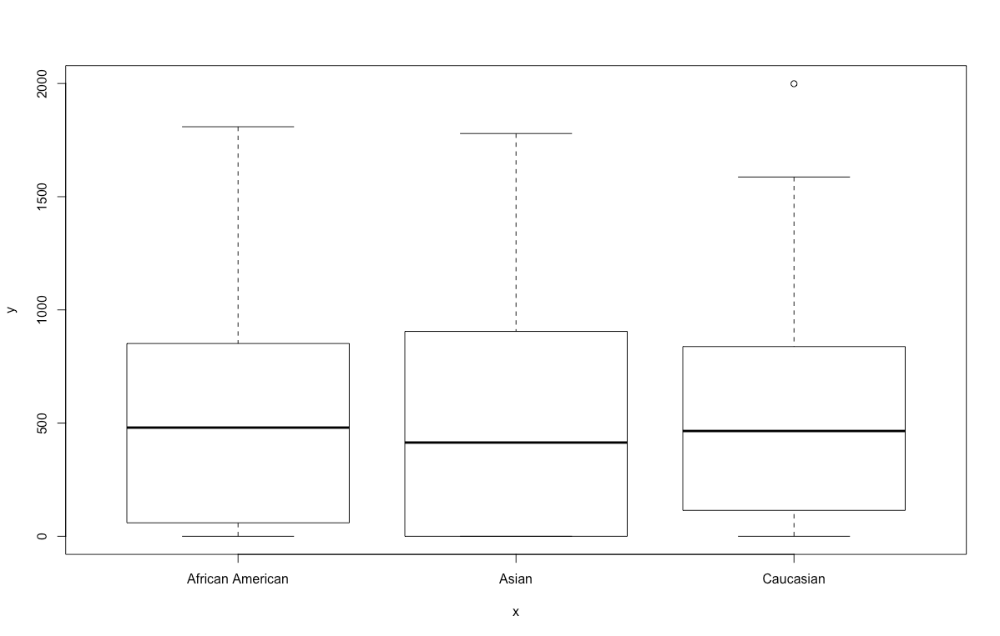

# Quiz 11 Antonio Pelayo March 4, 2020
## 3.4 Review Questions
### 3.4.R1
1/1 point (graded)

According to the balance vs ethnicity model, what is the predicted balance for an 
Asian in the data set? (within 0.01 accuracy)
 
 ```
# Set dir, grab credit data
> setwd("~/Desktop/stanford-statistical-learning/ch3-linear-regression/3.4-some-important-questions/")
> credit = read.csv("../../data/Credit.csv")

# Take a quick look at the data
> plot(credit$Ethnicity, credit$Balance)
```

```
# Separate data frame for Asians 
> creditAsian = credit[credit$Ethnicity == 'Asian', ]
> mean(creditAsian$Balance)
[1] 512.31
 ```
Explanation:

For an Asian, the predicted balance is the intercept plus the Asian ethnicity effect.
Submit Some problems have options such as save, reset, hints, or show answer. 
These options follow the Submit button.


### 3.4.R2
1/1 point (graded)

What is the predicted balance for an African American? (within .01 accuracy)
```
# Set dir, grab credit data
> setwd("~/Desktop/stanford-statistical-learning/ch3-linear-regression/3.4-some-important-questions/")
> credit = read.csv("../../data/Credit.csv")

# Take a quick look at the data
> plot(credit$Ethnicity, credit$Balance)

# Separate data frame for African Americans
> creditAA = credit[credit$Ethnicity == 'African American', ]
> mean(creditAA$Balance)
[1] 531
```
Explanation:

For an African American, the predicted balance is just the intercept.
Note that despite the differing predictions, this difference is not statistically 
significant.